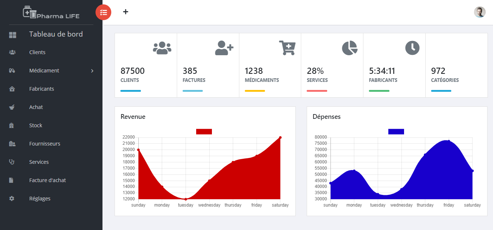

## Introduction

Pharma life is a web application that allows the management of a pharmacy.

## Informations
-   Status: under development
-   Latest version: 1.0
-   Sector: medical
-   Created: November 2020
-   Last updated: November 2020

## Table of contents
* [Documentation](#general-info)
* [Demo](#demo)
* [Screenshots](#screenshots)
* [Technologies](#technologies)
* [Setup](#setup)
* [Features](#features)
* [Status](#status)
* [Contact](#contact)
* [License](#license)

## Documentation
https://github.com/aniskchaou/PHARMALIFE-FRONTEND-ADMIN/wiki

## Demo
https://pharma-life.herokuapp.com/

## Screenshots

## Technologies
* Spring boot
* Node.js
* Angular

## Setup

## Features
 -   Manage drug and pharmaceutical / parapharmaceutical sales operations
 - Manage orders for laboratory preparation of galenic drugs
 - Manage the drug supply operation and stock control
 - Monitor store management activities (cash register management, employee payroll, invoice settlement, etc.)

  

## Contact
contact@delta-dev-software.com

## License
<a href="license.txt">MIT License</a>